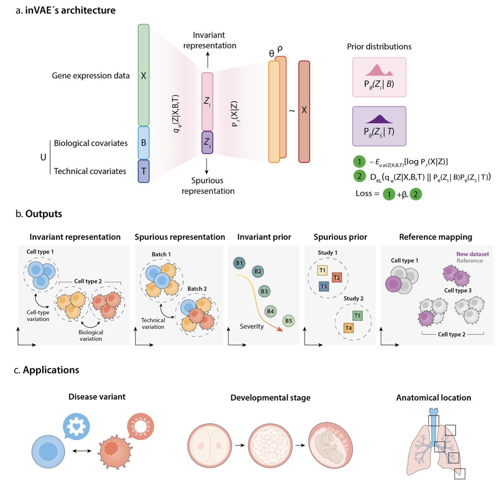

# inVAE reimplemented

Reimplementing the inVAE paper that aims at building representations of single-cell data.



## Install

Create a virtual environment:

```bash
uv venv .venv --python 3.12  # or any version of python >=3.10
source .venv/bin/activate
uv sync
```

`invae` is now installed as a package and as a command line tool. If you also want the optional dev and docs dependencies:

```bash
uv sync --extra dev --extra docs
```

## Run the project

The recommended way to run the code of this project is via CLI.:

```console
uv run invae --help
```

which should return the list of the available commands:

```text
 Usage: invae [OPTIONS] COMMAND [ARGS]...

 Run all datascience commands.

╭─ Commands ──────────────────────────────────────────────────╮
│ data     Manages data flow.                                 │
│ model    Manages model training and predictions.            │
╰─────────────────────────────────────────────────────────────╯
```

## Documentation

To preview your documentation in real-time while editing, run:

```console
uv sync --extra docs
mkdocs serve
```

Learn about serving the documentation, adding pages and deploying [here](./docs/contributing/documentation.md).
